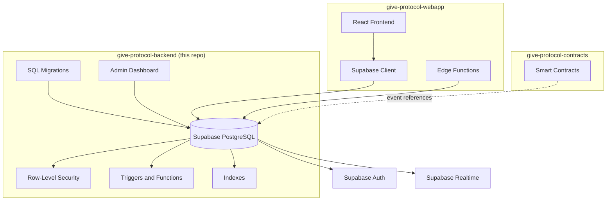

# Give Protocol Backend

Backend infrastructure for Give Protocol, a Delaware-based 501(c)(3) nonprofit building transparent charitable giving on blockchain. This repository is the single source of truth for the PostgreSQL database schema, including all tables, migrations, Row-Level Security (RLS) policies, triggers, and indexes. It also provides a React-based admin dashboard for platform management.

## Architecture



**What this repo owns:**
- Database schema (tables, columns, indexes, RLS policies) in `supabase/migrations/`
- Admin dashboard (React) in `src/pages/admin/`
- Supabase client configuration, authentication services, and monitoring
- TypeScript type generation from the database schema

**What this repo does NOT own:**
- Supabase Edge Functions (those live in the webapp repo under `supabase/functions/`)
- Frontend application code (webapp repo)
- Smart contracts (contracts repo)

## Database Schema

The database contains 51 migrations defining the following core tables:

### User and Authentication

| Table | Purpose |
|-------|---------|
| `profiles` | Core user identity. Links `auth.uid()` to internal `profiles.id`. Contains `type` (donor/charity/admin), wallet address, and metadata. |
| `donor_profiles` | Donor-specific data: preferred categories, donation frequency, total donated. |
| `user_preferences` | Notification and privacy settings per user. |

### Donations

| Table | Purpose |
|-------|---------|
| `donations` | Crypto donations: donor, charity, amount, token, transaction hash, on-chain status. |
| `fiat_donations` | Card payments via Helcim: card info, disbursement status, subscription linking. |
| `fiat_subscriptions` | Recurring fiat donations (monthly/quarterly/yearly). |
| `checkout_sessions` | HelcimPay.js checkout token validation and expiration tracking. |
| `donation_impacts` | Impact metrics tied to specific donations. |

### Charities

| Table | Purpose |
|-------|---------|
| `charity_details` | Organization profile: name, description, category, balances, mission statement, impact stats, impact highlights. |
| `charity_documents` | Uploaded verification documents (tax certificates, registration, annual reports). |
| `charity_categories` | Predefined categories (Education, Healthcare, Environment, etc.). |
| `withdrawal_requests` | Charity fund withdrawal requests with approval workflow (pending/approved/rejected). |
| `impact_metrics` | Time-series impact tracking using PostgreSQL range types. |

### Volunteers

| Table | Purpose |
|-------|---------|
| `volunteer_opportunities` | Charity-posted volunteer positions with commitment types. |
| `volunteer_applications` | User applications for positions. |
| `volunteer_hours` | Tracked hours with charity approval workflow. |
| `skills` | Predefined skills database (Web Development, Project Management, etc.). |
| `user_skills` | User skill proficiency levels (beginner/intermediate/expert). |
| `skill_endorsements` | Peer endorsements for user skills. |

### Security and Indexing

**Row-Level Security:** All tables have RLS enabled. Users access only their own data. Charities manage their own details, documents, and volunteer opportunities. Admins can process withdrawal requests. All RLS policies use `(SELECT auth.uid())` subqueries to avoid per-row re-evaluation.

**Key database functions:**
- `handle_new_user()` -- Auto-creates a profile when a user signs up via Supabase Auth
- `update_charity_balances()` -- Automatically updates charity balance totals when donations are inserted or deleted
- `validate_withdrawal_amount()` -- Ensures withdrawal requests do not exceed available balance
- `verify_volunteer_hash()` -- Validates volunteer verification hashes
- `check_charity_profile()` -- Validates only charity profiles can request withdrawals

All functions use `SECURITY DEFINER` or `SECURITY INVOKER` as appropriate, with `SET search_path = public` to prevent SQL injection.

**Performance indexes:** Composite indexes on `donations(donor_id, charity_id)`, partial index on active withdrawals, GiST index on impact metrics time ranges, and `created_at DESC` indexes on most tables.

## Admin Dashboard

The admin interface (`src/pages/admin/`) provides platform-wide management:

| Page | Function |
|------|----------|
| Dashboard | Statistics overview, key metrics |
| Charities | Charity approval, verification document review |
| Donations | Crypto and fiat donation tracking |
| Users | User management, profile inspection |
| Withdrawals | Process withdrawal requests (approve/reject) |
| Verifications | Charity document verification workflow |
| Audit Logs | Activity logging and review |
| Settings | System configuration |

Access requires `profile.type === 'admin'`. Unauthorized users are redirected.

## Environment Setup

Copy `.env.example` to `.env`:

```env
# Database
DATABASE_URL=
SUPABASE_URL=
SUPABASE_SERVICE_KEY=          # Never commit this
SUPABASE_ANON_KEY=

# Blockchain
MOONBASE_RPC_URL=https://rpc.api.moonbase.moonbeam.network
MOONBEAM_RPC_URL=

# Contract addresses
DONATION_CONTRACT_ADDRESS=
VERIFICATION_CONTRACT_ADDRESS=
DISTRIBUTION_CONTRACT_ADDRESS=

# Email integration
MAILCHIMP_API_KEY=
MAILCHIMP_SERVER_PREFIX=
MAILCHIMP_LIST_ID=

# Authentication
JWT_SECRET=
JWT_EXPIRY=7d
API_KEY_SALT=

# Environment
NODE_ENV=development
PORT=3001
```

## Development

### Prerequisites

- Node.js 18+
- npm
- Supabase CLI (for local development)

### Commands

```bash
npm run dev              # Start local Supabase instance
npm run stop             # Stop local Supabase
npm run reset            # Full database reset (applies all migrations fresh)
npm run generate-types   # Generate TypeScript types from current schema
npm run migrate          # Push migrations to remote Supabase
npm run seed             # Seed database with test data
```

### Workflow

1. Start local Supabase: `npm run dev`
2. Create or modify migration SQL files in `supabase/migrations/`
3. Test migrations locally: `npm run reset`
4. Generate updated TypeScript types: `npm run generate-types`
5. Commit migration files and generated types

### Migration Naming Convention

Migrations are named with a timestamp prefix:

```
supabase/migrations/
├── 20250101000000_create_profiles.sql
├── 20250102000000_create_donations.sql
├── ...
└── 20260218200000_add_charity_impact_fields.sql
```

## Monitoring

### Sentry Integration

Production error tracking with:
- Browser tracing (10% sample rate)
- Session replay (1% normal, 100% on errors)
- Filters for network errors, browser extension noise, and ResizeObserver warnings
- Custom event tracking for transactions and donations

### Custom Monitoring Service

Client-side performance tracking:
- Long task detection (>50ms)
- Resource timing (CSS, JS, images)
- API call monitoring (method, status, duration)
- Batched metric submission (100 per batch, 5-second flush)

## Security

### CI/CD

- **GitHub Actions:** Trivy filesystem scanning on push and daily schedule (CRITICAL and HIGH severity)
- **npm audit:** Dependency vulnerability scanning
- **DeepSource:** Code quality analysis (SQL, JavaScript, React)

### Secrets Management

- Service role keys are never committed to version control
- All admin functions require authenticated sessions
- Helcim API credentials are stored in Supabase Dashboard secrets, not in `.env`
- Credential rotation is recommended quarterly (see `SECURITY.md` in contracts repo)

## API Client

The Supabase client (`src/lib/supabase.ts`) provides:
- PKCE authentication flow with auto-refresh tokens
- Local storage persistence (`give-protocol-auth` key)
- RPC retry logic with exponential backoff (3 attempts)

The API client (`src/lib/api/client.ts`) adds:
- Response caching (5-minute TTL, 100-item LRU)
- Request deduplication via abort controllers
- Retry logic with exponential backoff

## Project Structure

```
give-protocol-backend/
├── supabase/
│   ├── migrations/           # 51 SQL migration files (schema source of truth)
│   └── functions/            # Empty (edge functions live in webapp repo)
├── src/
│   ├── pages/admin/          # Admin dashboard (8 React components)
│   ├── lib/
│   │   ├── supabase.ts       # Supabase client initialization
│   │   ├── sentry.ts         # Error tracking configuration
│   │   ├── auth.ts           # Authentication service
│   │   └── api/              # API client, queries, types
│   └── utils/
│       └── monitoring/       # Performance monitoring service
├── .github/workflows/
│   └── security.yml          # Trivy + npm audit scanning
├── package.json
├── .env.example
└── .deepsource.toml          # Code quality configuration
```

## Repository Context

This is the **backend** repository in the Give Protocol multi-repo architecture:

| Repository | Purpose |
|------------|---------|
| [give-protocol-backend](https://github.com/GiveProtocol/give-protocol-backend) | Database and admin (this repo) |
| [give-protocol-webapp](https://github.com/GiveProtocol/give-protocol-webapp) | React web application |
| [give-protocol-contracts](https://github.com/GiveProtocol/give-protocol-contracts) | Solidity smart contracts |
| [give-protocol-docs](https://github.com/GiveProtocol/give-protocol-docs) | Documentation site |

**Key integration point:** The `profiles.id` (UUID) is the internal user identity across the entire system. `profiles.user_id` maps to `auth.uid()` from Supabase Auth.

## License

UNLICENSED -- Private Repository
